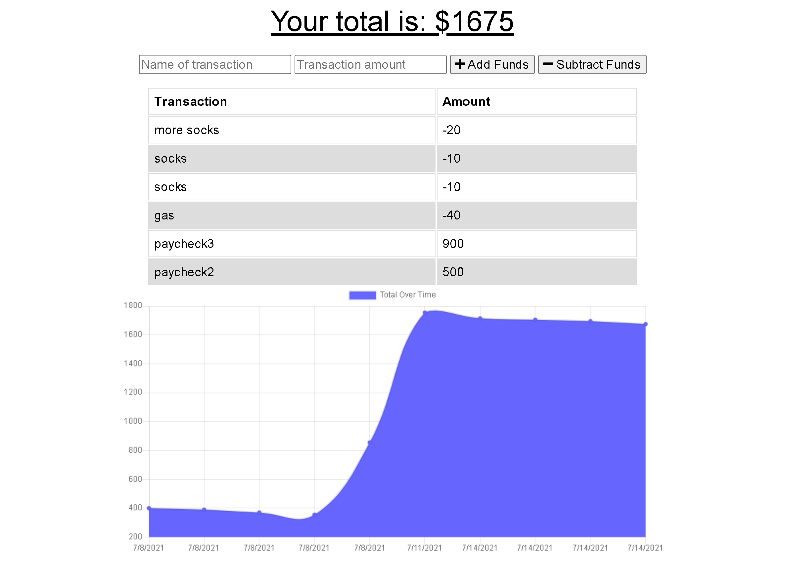

# Offline Budget Tracker

## Contents
1. [About](#About)
2. [Description](#Description)
3. [Screen-Shots](#Screen-Shots)
4. [Contact-Info](#Contact-Info)
5. [License](#License)

## About
An app that can be downloaded to your machine as a PWA to help stay on your budget by keeping log of all transactions you make. Even if offline, the app will log transactions, once reconnected to the internet, the database will be updated and all transactions saved. Perfect for long trips when you're not sure if you will lose wifi signal.

## Description
This app uses MongoDB as its primary database. IndexedDB has been implemented to keep track of transactions when not connected to the internet. Once a transaction is logged, if the app failed to connect to Mongo, it will use IndexedDB to temporarily store the transactions. Once reconnected to the internet, the app will query its IndexedDB for any entries, upload them to the MongoDB and clear out its IndexedDB. The app is also equipped with a service worker to save all static files and a webmanifest to download to your machine as a PWA.

## Screen-shots

## Contact-Info
Alan Gaudet - <alanmgaudet@gmail.com>

Portfolio - <https://github.com/amgaudet>

## License
MIT License

Copyright (c) 2021 Alan Gaudet

Permission is hereby granted, free of charge, to any person obtaining a copy
of this software and associated documentation files (the "Software"), to deal
in the Software without restriction, including without limitation the rights
to use, copy, modify, merge, publish, distribute, sublicense, and/or sell
copies of the Software, and to permit persons to whom the Software is
furnished to do so, subject to the following conditions:

The above copyright notice and this permission notice shall be included in all
copies or substantial portions of the Software.

THE SOFTWARE IS PROVIDED "AS IS", WITHOUT WARRANTY OF ANY KIND, EXPRESS OR
IMPLIED, INCLUDING BUT NOT LIMITED TO THE WARRANTIES OF MERCHANTABILITY,
FITNESS FOR A PARTICULAR PURPOSE AND NONINFRINGEMENT. IN NO EVENT SHALL THE
AUTHORS OR COPYRIGHT HOLDERS BE LIABLE FOR ANY CLAIM, DAMAGES OR OTHER
LIABILITY, WHETHER IN AN ACTION OF CONTRACT, TORT OR OTHERWISE, ARISING FROM,
OUT OF OR IN CONNECTION WITH THE SOFTWARE OR THE USE OR OTHER DEALINGS IN THE
SOFTWARE.
